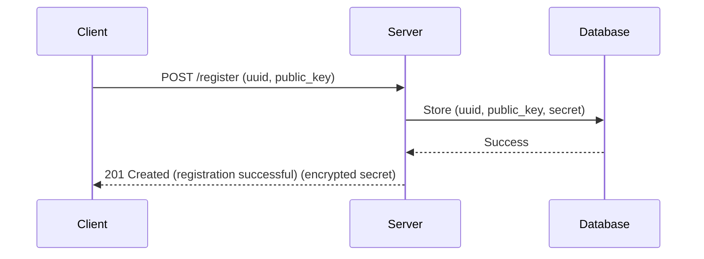
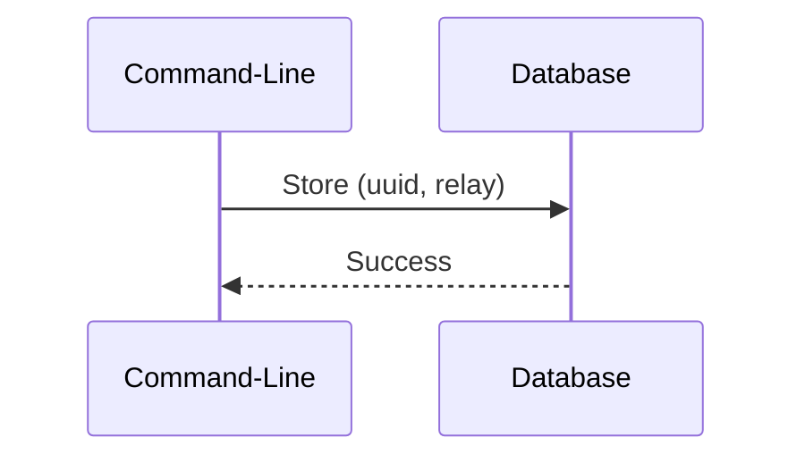
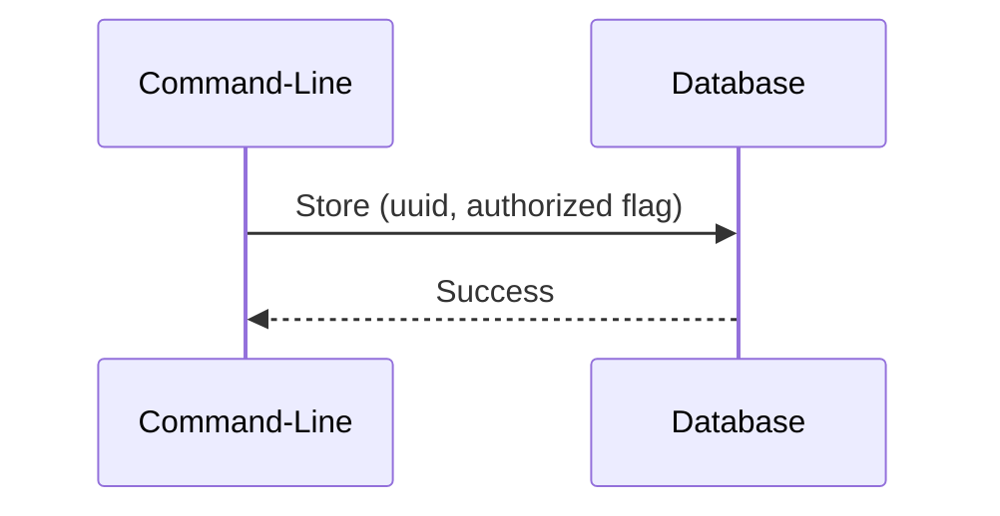
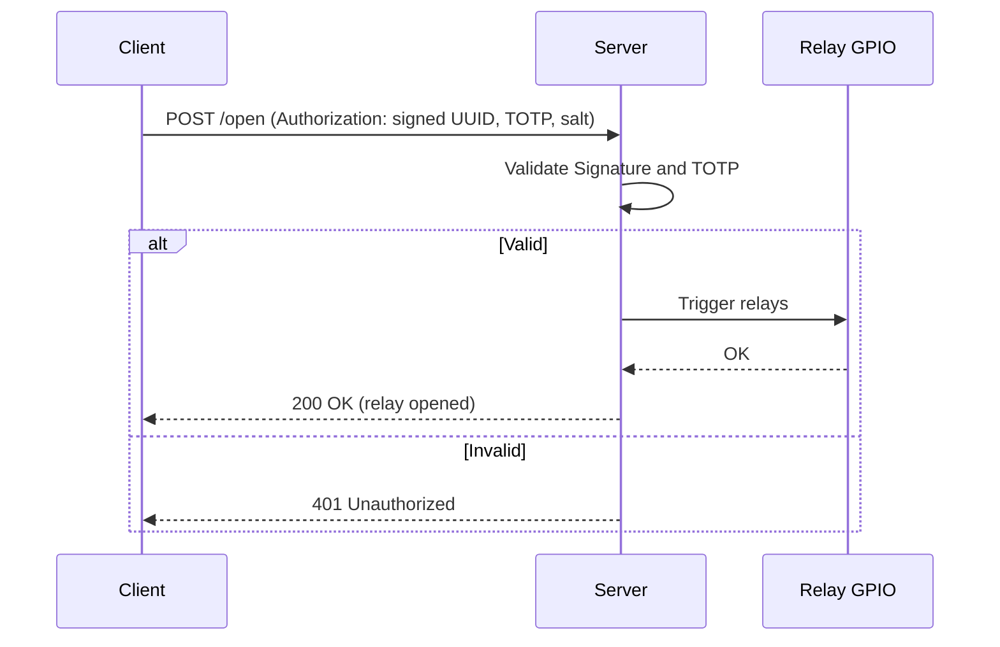

# Identity-based Control Trigger (ICT)

A lightweight, secure web server running on a Raspberry Pi to **authenticate users and activate relays via GPIO**.  
ICT uses **identity-based authentication (RSA keys + TOTP)** to ensure only authorized devices can trigger actions.

---

## ✨ Features
- 🔒 **Secure authentication** with RSA keys and TOTP  
- ⚡ **Relay control** via Raspberry Pi GPIO  
- 🌐 **REST API** for easy integration  
- 📜 **Audit logging** of all actions  
- 🛠 **Lightweight and fast** (built in Rust)  

## Important Notes
- This is not a production ready project. Be aware that a lot of elbow grease is still needed to properly and securely install and run on a Pi (nginx, logrotate, service configuration, firewall, to name a few). I provide a few examples, but this is highly dependant on your use case.
- The security claims are my opinion only, use at your own risk. That said, if anyone uses this and find bugs/security risk, please let me know or create a pull request to address the issue.

---

## 📋 To-Do List
- Replace `rouille` with `tiny_http` (to remove deprecated dependencies: `buf_redux`, `multipart`)  

---


## Design

A client needs to first create for itself a UUID and a pair of public/private key. Using a secure enclave for the private key if possible.
The client then calls the register action, passing its UUID and public key.
The server will store those, but at this point the client is neither authorized nor has relays associated with it.
The sercer will then respond with a secret (encrypted with the public key) to be used later by TOTP.

An admin needs to use the command line (same executable) to associate relays and authorize the client. There is no public API to do this by design (simpler, safer), but one could optionally be added.

Once that is done, the client operate a relay by calling the operate action, passing UUID, TOTP and salt in a token signed by the private key.
Upon receiving the operate call, the server first verify the signature, then the TOTP, and actuate the relay for a duration specified in the configuration.

### 📜 Register Action



### 📜 Associate Relay Action



### 📜 Authorize Action



### ⚡ Operate Action




---

## 🛠 Handy Commands

```bash
# Run tests with logs
RUST_LOG=info cargo test -- --nocapture

# Run with GPIO feature
cargo run --features gpio -- serve -p 3456

# Run server (may require sudo)
sudo cargo run --features gpio -- serve -p 3456

# Run specific test
RUST_LOG=info cargo test --features gpio -- test_happy_path --nocapture

# Shutdown Pi
sudo shutdown -h now

# Authorize a device
cargo run --features gpio -- authorize
cargo run -- authorize -u E791366E-40CE-4F85-8F92-8B7E6185EDC

# Associate a relay
cargo run -- associate-relay -r 10 -u E791366E-40CE-4F85-8F92-8B7E6185EDC1

# Pin control
pinctrl
pinctrl poll 16,20,21
```
