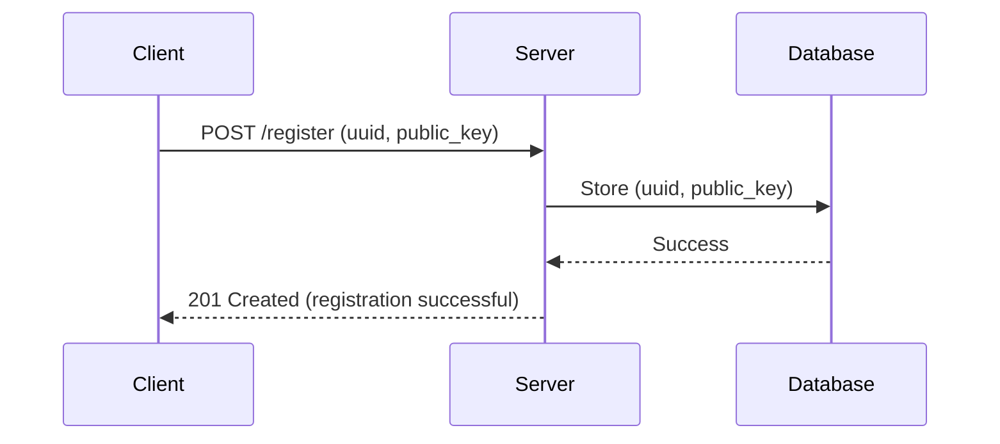
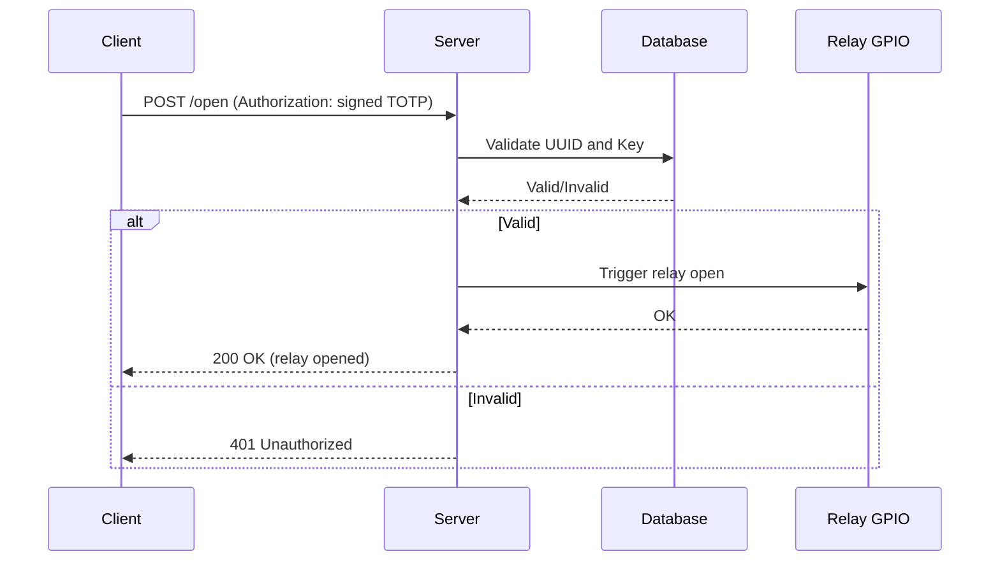

# Identity-based Control Trigger (ICT)

A lightweight, secure web server running on a Raspberry Pi to **authenticate users and activate relays via GPIO**.  
ICT uses **identity-based authentication (RSA keys + TOTP)** to ensure only authorized devices can trigger actions.

---

## ✨ Features
- 🔒 **Secure authentication** with RSA keys and TOTP  
- ⚡ **Relay control** via Raspberry Pi GPIO  
- 🌐 **REST API** for easy integration  
- 📜 **Audit logging** of all actions  
- 🛠 **Lightweight and fast** (built in Rust)  

## Important Notes
- This is not a production ready project. Be aware that a lot of elbow grease is still needed to properly and securely install and run on a Pi (nginx, logrotate, service configuration, firewall, to name a few). I provide a few examples, but this is highly dependant on your use case.
- The security claims are my opinion only, use at your own risk. That said, if anyone uses this and find bugs/security risk, please let me know or create a pull request to address the issue.

---

## 📋 To-Do List
- Replace `rouille` with `tiny_http` (to remove deprecated dependencies: `buf_redux`, `multipart`)  

---


## Design

### 📜 Register Action



### ⚡ Operate Action




---

## 🛠 Handy Commands

```bash
# Run tests with logs
RUST_LOG=info cargo test -- --nocapture

# Run with GPIO feature
cargo run --features gpio -- serve -p 3456

# Run server (may require sudo)
sudo cargo run --features gpio -- serve -p 3456

# Run specific test
RUST_LOG=info cargo test --features gpio -- test_happy_path --nocapture

# Shutdown Pi
sudo shutdown -h now

# Authorize a device
cargo run --features gpio -- authorize
cargo run -- authorize -u E791366E-40CE-4F85-8F92-8B7E6185EDC

# Associate a relay
cargo run -- associate-relay -r 10 -u E791366E-40CE-4F85-8F92-8B7E6185EDC1

# Pin control
pinctrl
pinctrl poll 16,20,21
```
